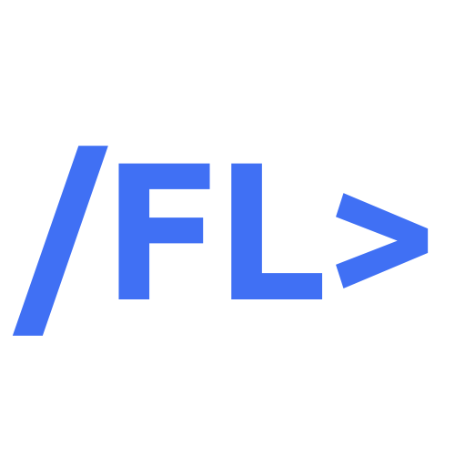
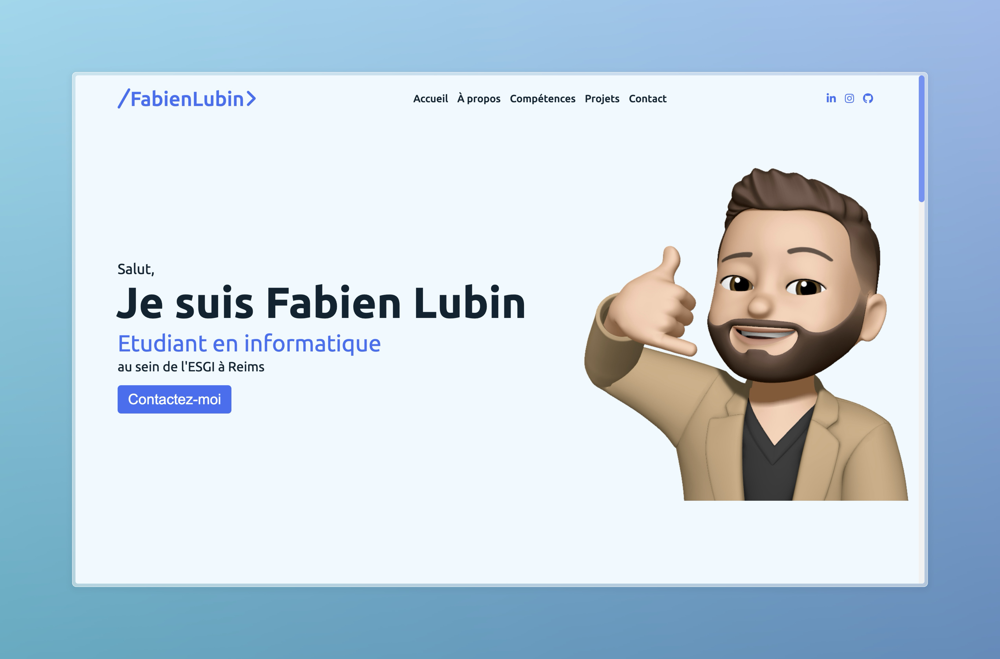

<div align="center">
  
  <h1>/FL> Portfolio</h1>
  
  [](https://fabienlubin.fr)
  [](https://github.com/MrCoolBay/Portfolio/commits/main)
  [](https://php.net)
  [](https://www.w3.org/Style/CSS/)
</div>

## 📋 Sommaire

- [À Propos](#-à-propos)
- [Fonctionnalités](#-fonctionnalités)
- [Technologies Utilisées](#-technologies-utilisées)
- [Structure du Projet](#-structure-du-projet)
- [Installation](#-installation)
- [Captures d'écran](#-captures-décran)
- [Contact](#-contact)

## 🚀 À Propos

Portfolio personnel présentant mes compétences en développement web et mes réalisations. Conçu avec une approche moderne et responsive, ce site permet de mettre en valeur mon travail et mon parcours professionnel.

## ✨ Fonctionnalités

- 🎯 Design responsive et moderne
- 💼 Présentation des projets avec détails et démos
- 📊 Section compétences avec visualisation des niveaux
- 📱 Interface adaptative sur tous les appareils
- 🌙 Animations fluides et intuitives

## 🛠 Technologies Utilisées

- 
- 
- 
- 
- 

## 📁 Structure du Projet

```
portfolio/
├── assets/
│   ├── css/
│   │   ├── menu.css
│   │   ├── 404.css
│   │   └── realisations.css
│   ├── js/
│   │   └── script.js
│   └── img/
├── controllers/
│   └── controller.php
├── models/
│   └── model.php
├── views/
│   ├── 404.php
│   ├── menu.php
│   ├── home.php
│   └──  realisations.php
├── index.php
└── README.md
```

## ⚙️ Installation

1. Clonez le repository

```bash
git clone https://github.com/MrCoolBay/Portfolio.git
```

2. Configurez votre serveur web (Apache/Nginx) pour pointer vers le dossier du projet

3. Assurez-vous que PHP est installé sur votre système

4. Démarrez votre serveur local

```bash
php -S localhost:8000
```

5. Accédez au site via votre navigateur

```
http://localhost:8000
```

## 📸 Captures d'écran

<div align="center">
  
</div>

## 🌟 Fonctionnalités à Venir

- [ ] Mode sombre
- [ ] Blog intégré
- [ ] Filtre dynamique des projets
- [ ] Multilingue (FR/EN)

## 📧 Contact

N'hésitez pas à me contacter pour toute question ou suggestion :

- Portfolio : [fabienlubin.fr](https://fabienlubin.fr)
- Email : [contact@fabienlubin.fr](mailto:contact@fabienlubin.fr)
- LinkedIn : [Fabien Lubin](https://www.linkedin.com/in/fabien-lubin-695344291/)
- GitHub : [@MrCoolBay](https://github.com/MrCoolBay)

## 📄 Licence

Ce projet est sous licence MIT - voir le fichier [LICENSE.md](LICENSE.md) pour plus de détails.

---

<div align="center">
  <sub>Fait avec ❤️ par /FL></sub>
</div>
